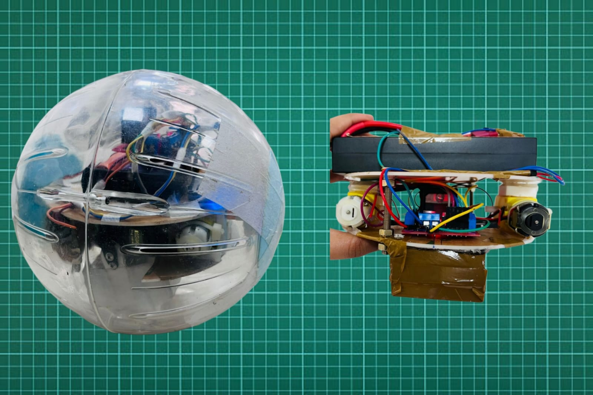

### Design and Development of Spherical Robot



---

#### 🤖 **Project Overview**
The **Spherical Mobile Robot** is an innovative, self-balancing robot designed to navigate complex environments with agility and precision. This project integrates advanced control systems with **MATLAB** and **Simulink** to enable smooth, autonomous movement within a spherical shell, offering stability and maneuverability.

---

#### 🔧 **Features**
- **Self-Balancing Mechanism:** Maintains equilibrium using advanced feedback loops.
- **MATLAB & Simulink Integration:** Allows precise control and simulation of movement.
- **Obstacle Detection & Avoidance:** Uses sensors to detect and navigate around obstacles.
- **Modular Design:** Easy to upgrade and customize hardware and software components.

---

#### 🛠 **Technologies Used**
- **Programming:** MATLAB, Simulink
- **Hardware:** Microcontrollers, Gyroscope, Accelerometer, Motor Drivers
- **Control Systems:** PID Control, Feedback Loops

---

#### 🚀 **Getting Started**
1. **Clone the Repository:**
```bash
git clone https://github.com/your-username/spherical-mobile-robot.git
```
2. **Open MATLAB & Simulink:**
   - Navigate to the project folder and open the `.slx` files for simulation.
3. **Hardware Setup:**
   - Connect microcontrollers and sensors as per the provided schematic.
4. **Run the Simulation:**
   - Upload the code to your hardware and watch the robot in action!

---

#### 📁 **Project Structure**
```
├── /code
│   ├── control_system.slx
│   ├── motor_driver.m
├── /hardware
│   ├── wiring_diagram.png
│   ├── parts_list.txt
├── README.md
└── LICENSE
```

---

#### 📝 **Contributing**
Contributions are welcome! Feel free to fork the repository, submit pull requests, or open issues for improvements.

---

#### 📄 **License**
This project is licensed under the MIT License.

---

#### 😊 **Let's Connect!**
[](https://www.linkedin.com)  
[](https://github.com)  
[](https://twitter.com)

---

_"Innovating mobility, one sphere at a time."_

